# This project is Archived

This plugin was integrated in the [OpenTelemetry plugin](https://github.com/jenkinsci/opentelemetry-plugin)

# elastic-stack-logs
Elastic Stack logs Plugin

This plugins replaces the default logs storage for pipelines,
the new implementation stores the logs in Elasticsearch using Opentelemetry or Filebeat.

* [JEP-210: External log storage for Pipeline](https://github.com/jenkinsci/jep/blob/master/jep/210/README.adoc)
* [JEP-207: External Build Logging support in the Jenkins Core](https://github.com/jenkinsci/jep/blob/master/jep/207/README.adoc)

# Configure

The plugin add a new section in the System Configuration named Elastic Stack, there you can setup the plugin settings.

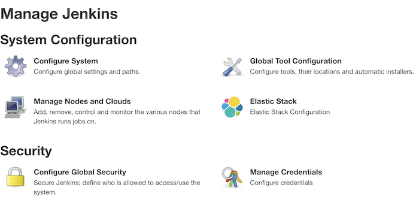

## Elastic Stack settings

The plugin need some Elastic Stack setting to retrieve the logs from Elasticsearch and create links to the logs views in Kibana.
it is need to know the URL of Elasticsearch and the credentials to access, and the URL of Kibana.

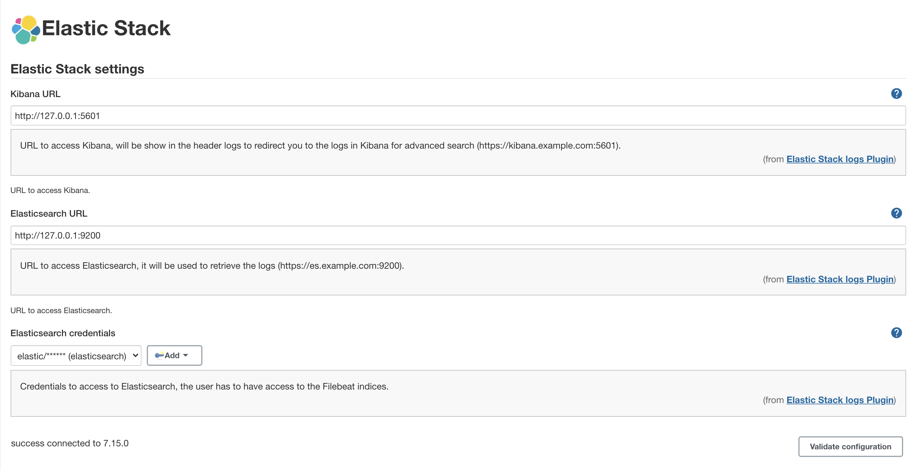

## Filebeat

The Filebeat inputs require a Filebeat service up and running to connect to it.
This Filebeat service should expose an input of one of the following types:

* [log](https://www.elastic.co/guide/en/beats/filebeat/current/filebeat-input-log.html)
* [filestream](https://www.elastic.co/guide/en/beats/filebeat/current/filebeat-input-filestream.html)
* [tcp](https://www.elastic.co/guide/en/beats/filebeat/current/filebeat-input-tcp.html)
* [udp](https://www.elastic.co/guide/en/beats/filebeat/current/filebeat-input-udp.html)

The plugin will use this input to send the events.

### File input

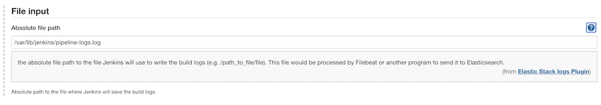

### TCP input

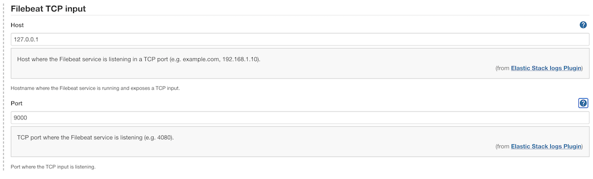

### UDP input

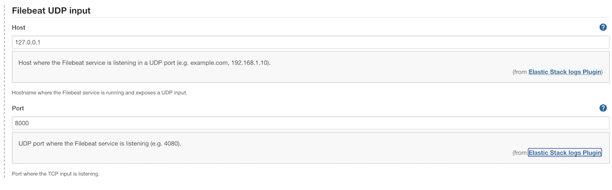

## OpenTelenetry input

The OpenTelemetry input require a OpenTelemetry service up and running to connect to it.
[OpenTelemetry Collector](https://opentelemetry.io/docs/collector/) is one of the options to expose a OpenTelemetry service and send the traces and logs to Elasticsearch, Jaeger, or other storage services, you can find a example configuration at [test folder](src/test/resources)

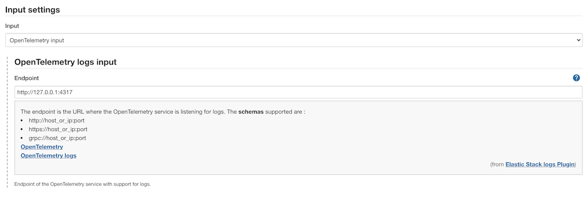

## Index settings

The index settings are used to retrieve the Elasticsearch logs, the index should exists.

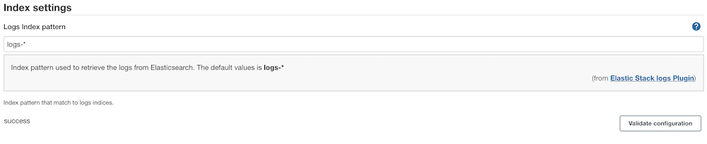

# How to check build logs

There is two ways to check the logs,
one is the Jenkins Console logs that changes it behaviour to retrieve logs from Elasticsearch instead the from disk,
and the other that it is to go to Kibana logs or directly in Kibana discover,
in Kibana we can search for strings and filter our logs.
To go to the Kibana logs we have a button in the build menu.

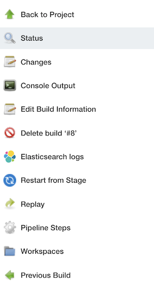

And two links in the build status.

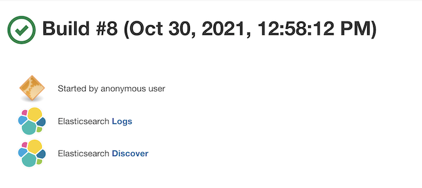

# Configuration errors

## Elastic Stack

The Elastic Stack configuration has a button to validate the configuration,
This button will try to connect to Elasticsearch
and checks if the index pattern exists.

These are the possible errors:

When you did not set credentials.
You must set a valid credentials to access to Elasticsearch.

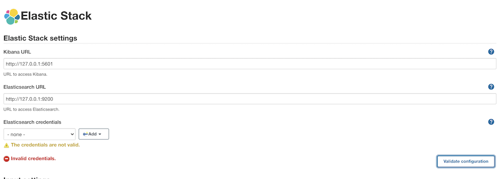

When the host is wrong.
Check that the URL of the host is correct and you can resolve that DNS name from the Jenkins hosts.

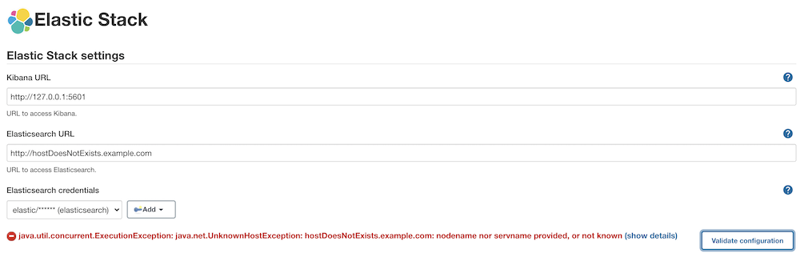

When the URL is malformed/invalid. You must set a proper URL.

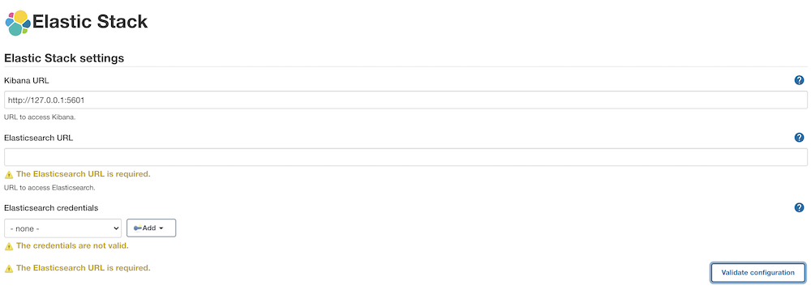

When the port is not correct or the service is not reachable.
Check that the port is correct, also if you can reach that host and port from the Jenkins hots.

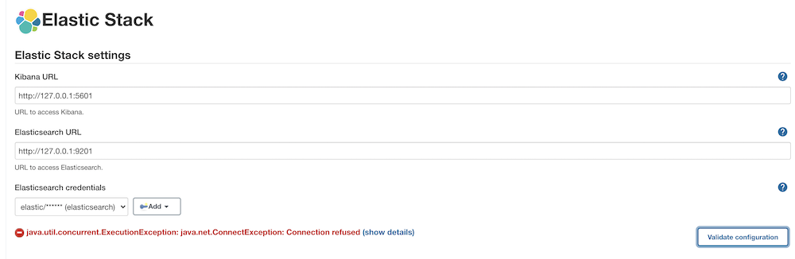

When the credentials are not correct.
Check that the credentials are correct.

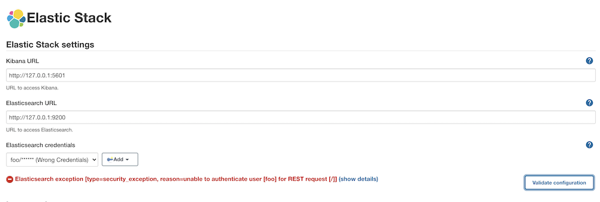

## Index setting

The index settings has a validation button that will connect to Elastisearch
and check that the index pattern configured exists and is accessible.

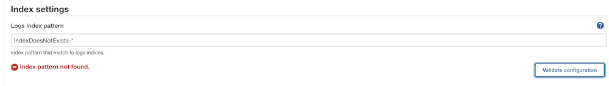

## Fileds validations

When required fields are empty you will show the following error under the field,
you must set a valid value on those fields to make the plugin work correctly.

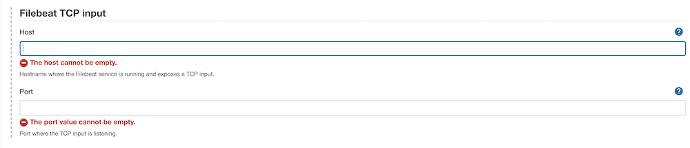

The URLs are validated in case that a URL field contains an invalid URL,
you will see the following error under the field.

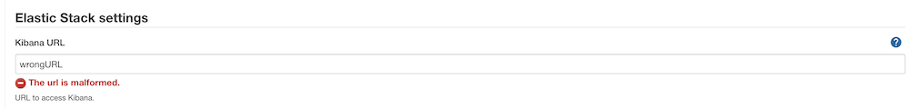

## Console logs

The console log of Jenkins will work as usual
but instead of read the logs from disk will retrieve the logs from Elasticsearch.
In case the index pattern configured does not exists
the following message will show in the console log of the builds.

Set a no valid index pattern disabled the logs retrieve but not the indexation.

# Libraries

* [Elasticsearch Java REST Client](https://www.elastic.co/guide/en/elasticsearch/client/java-rest/current/index.html)
* [OpenTelemetry Java](https://github.com/open-telemetry/opentelemetry-java)
* [OpenTelemetry Logging](https://github.com/open-telemetry/opentelemetry-specification/blob/main/specification/logs/overview.md)
* [OpenTelemetry logs data model](https://github.com/open-telemetry/opentelemetry-specification/blob/main/specification/logs/data-model.md)
* [OpenTelemetry logs protocol](https://github.com/open-telemetry/opentelemetry-proto/blob/main/opentelemetry/proto/logs/v1/logs.proto)
