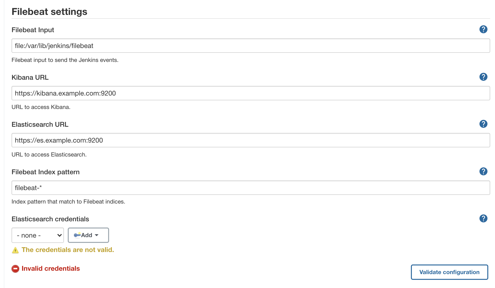
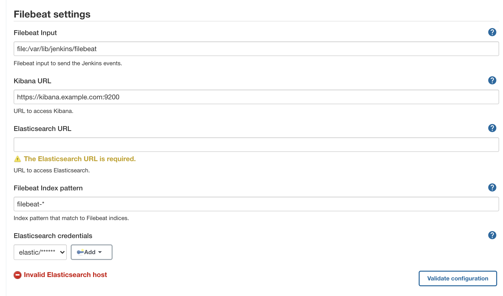
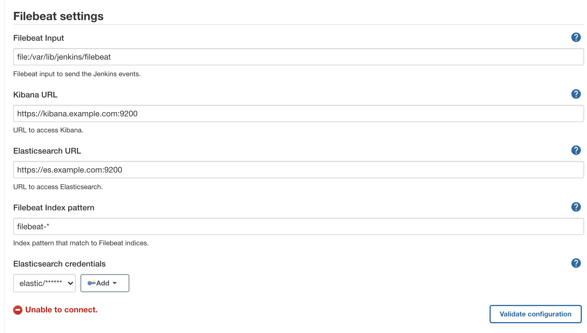

# elastic-stack-logs
Elastic Stack logs Plugin

This plugins replaces the default logs storage for pipelines,
the new implementation stores the logs in Elasticsearch using Opentelemetry or Filebeat.

[JEP-210: External log storage for Pipeline](https://github.com/jenkinsci/jep/blob/master/jep/210/README.adoc)
[JEP-207: External Build Logging support in the Jenkins Core](https://github.com/jenkinsci/jep/blob/master/jep/207/README.adoc)

# Requirements

The plugin requires a Filebeat or a OpenTelemetry service up and running to connect to it.
This Filebeat service should expose an input of one of the following types:

* [log](https://www.elastic.co/guide/en/beats/filebeat/current/filebeat-input-log.html)
* [filestream](https://www.elastic.co/guide/en/beats/filebeat/current/filebeat-input-filestream.html)
* [tcp](https://www.elastic.co/guide/en/beats/filebeat/current/filebeat-input-tcp.html)
* [udp](https://www.elastic.co/guide/en/beats/filebeat/current/filebeat-input-udp.html)

The plugin will use this input to send the events.

# Configure

At Configure System/Filebeat settings you can set the Filebeat, Elasticsearch, and Kibana settigns

* Filebeat Input (Required): Filebeat input to send the Jenkins events.
This input is an URI to the resource like <b>schema://path or host:port</b>
The *schemas* supported are :
  * tcp://host_or_ip:port
  * udp://host_or_ip:port
  * file://path_to_file/file
* Kibana URL: URL to access Kibana, will be show in the header logs to redirect
you to the logs in Kibana for advanced search (https://kibana.example.com:5601).
* Elasticsearch URL: URL to access Elasticsearch, it will be used to
retrieve the logs (https://es.example.com:9200).
* Filebeat Index pattern: Index pattern used to retrieve the logs from Elasticsearch.
  The default values is *filebeat-\**
* Elasticsearch credentials: Credentials to access to Elasticsearch, the user
has to have access to the Filebeat indices.

# Validate the Elasticsearch configuration

The configuration  has a button to validate the Elasticsearch configuration,
This button will try to connect to Elasticsearch
and checks if the Filebeat index pattern exists.

These are the possible errors:

When you did not set credentials.

When the URL os Elasticsearch is not valid.

When for other reasing the connection fails, in this case,
you have to check the Jenkins logs for more details.

# Enable ECS logging

    -Djava.util.logging.config.file=/var/lib/jenkins_home/logging.properties

# Enable APM

    -javaagent:classpath:/var/lib/jenkins_home/plugins/../elastic-apm-agent.jar

# Libraries

* [Elasticsearch Java REST Client](https://www.elastic.co/guide/en/elasticsearch/client/java-rest/current/index.html)
* [OpenTelemetry Java](https://github.com/open-telemetry/opentelemetry-java)
* [OpenTelemetry Logging](https://github.com/open-telemetry/opentelemetry-specification/blob/main/specification/logs/overview.md)
* [OpenTelemetry logs data model](https://github.com/open-telemetry/opentelemetry-specification/blob/main/specification/logs/data-model.md)
* [OpenTelemetry logs protocol](https://github.com/open-telemetry/opentelemetry-proto/blob/main/opentelemetry/proto/logs/v1/logs.proto)
